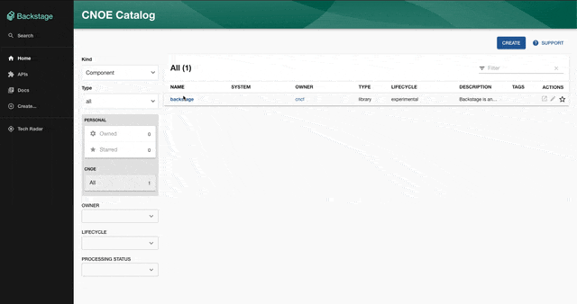

# argo-workflows

Welcome to the Argo Workflows plugin!

This plugin displays your Argo Workflows in Backstage

## Getting started




### Configuration

Entities must be annotated with Kubernetes annotations. An example component
would look like the following where you can configure the `spec` to your
liking. Information specific to Argo Workflows goes under `annotations` as 
shown below:

```yaml
apiVersion: backstage.io/v1alpha1
kind: Component
metadata:
  name: backstage
  annotations:
    backstage.io/kubernetes-namespace: default
    argo-workflows.cnoe.io/label-selector: env=dev,my=label
spec:
  type: service
  lifecycle: experimental
  owner: user1
  system: system1
```

Configure your Argo Workflows' instance base URL. Ths is optional. If defined, workflows will have links to Argo Workflows UI.

```yaml
argoWorkflows:
  baseUrl: https://my-argo-workflows.url
```

Update your Entity page. For example: 
```typescript
// in packages/app/src/components/catalog/EntityPage.tsx
import {
    EntityArgoWorkflowsOverviewCard,
    isArgoWorkflowsAvailable,
} from '@internal/plugin-argo-workflows';


const overviewContent = (
<Grid container spacing={3} alignItems="stretch">
    {entityWarningContent}
    <Grid item md={6}>
        <EntityAboutCard variant="gridItem" />
    </Grid>
    <EntitySwitch>
        <EntitySwitch.Case if={e => isArgoWorkflowsAvailable(e)}>
        <Grid item md={6}>
            <EntityArgoWorkflowsOverviewCard />
        </Grid>
        <Grid item md={6}>
            <EntityArgoWorkflowsTemplateOverviewCard />
        </Grid>
        </EntitySwitch.Case>
    </EntitySwitch>
        ...
</Grid>
);
```


#### Annotations
As shown in the example above, the following annotations could go under
`annotations` in the backstage `Component` and will be recognized by this plugin.

- `argo-workflows.cnoe.io/label-selector`: Required. The selector to choose the
  Argo workflow that carries the corresponding label
- `backstage.io/kubernetes-namespace`: Optional. The namespace to be search for finding Argo workflows. Defaults to the `default` namespace.
- Conditionally, one of the two labels below are required:
- `argo-workflows/cluster-name`: Optional. Specifies the name of the Kubernetes cluster to retrieve information from. If missing chooses the Kubernetes context available to backstage at runtime.

### Authentication

This plugin supports two methods of authentication.

#### Through Argo API with Service Account Token

This method uses a service account token to retrieve information from Argo API through the configured proxy endpoint.

1.  Create a service account and associated permissions. For this plugin to work, you need list, get, and watch verbs.
    for example create a file called `sa.yaml` with the following contents:
    ```yaml
    apiVersion: v1
    kind: ServiceAccount
    metadata:
    name: backstage-argo-workflows-plugin
    namespace: argo
        ---
        # This is a long-lived token intended to be used by the backstage proxy.
        apiVersion: v1
        kind: Secret
        metadata:
        name: backstage-argo-workflows-plugin-token
        annotations:
        kubernetes.io/service-account.name: backstage-argo-workflows-plugin
        namespace: argo
        type: kubernetes.io/service-account-token
        ---
        apiVersion: rbac.authorization.k8s.io/v1
        kind: ClusterRole
        metadata:
        name: backstage-argo-workflows-plugin
        rules:
        - apiGroups: ["argoproj.io"]
          resources: ["workflows"]
          verbs: [ "get", "watch", "list"]
        ---
        apiVersion: rbac.authorization.k8s.io/v1
        kind: ClusterRoleBinding
        metadata:
        name: backstage-argo-workflows-plugin
        roleRef:
        apiGroup: rbac.authorization.k8s.io
        kind: ClusterRole
        name: backstage-argo-workflows-plugin
        subjects:
        - kind: ServiceAccount
          name: backstage-argo-workflows-plugin
          namespace: argo
        ```
2.  Apply them to your cluster
    ```bash
    kubectl apply -f sa.yaml
    ```
3.  Configure [Backstage Proxy](https://backstage.io/docs/plugins/proxying). In this example we are instructing Backstage to get the token value from environment variable called `ARGO_WORKFLOWS_AUTH_TOKEN`
    ```yaml
    proxy:
      "/argo-workflows/api":
        target: https://argo.a1.mccloman.people.aws.dev
        changeOrigin: true
        secure: true
        headers:
          Authorization:
            $env: ARGO_WORKFLOWS_AUTH_TOKEN
    ```
4.  Grab the token value and make it available as an environment variable for your backstage backend.
    ```bash
    export ARGO_WORKFLOWS_AUTH_TOKEN="Bearer $(kubectl get secret -n argo backstage-argo-workflows-plugin-token -o=jsonpath='{.data.token}' | base64 --decode)"
    ```
    If this is running in Kubernetes see this [documentation](https://kubernetes.io/docs/tasks/inject-data-application/distribute-credentials-secure/#define-container-environment-variables-using-secret-data).

See [this documentation](https://argoproj.github.io/argo-workflows/access-token/) for more information on getting your token.

#### Using configured Kubernetes API

The plugin can use configured Kubernetes clusters to fetch resources instead of going through the Argo Workflows API
The entity must be annotated correctly for it to work.

For example, for a Kubernetes cluster given in your `app-config.yaml`

```yaml
kubernetes:
  serviceLocatorMethod:
    type: "multiTenant"
  clusterLocatorMethods:
    - type: "config"
      clusters:
        - url: https://abcd.gr7.us-west-2.eks.amazonaws.com:443
          name: my-cluster-1
          authProvider: "serviceAccount"
          serviceAccountToken: eyJh
          caData: LS0t
```

For this configuration, the `argo-workflows/cluster-name` annotaton value must be `my-cluster-1`

```yaml
apiVersion: backstage.io/v1alpha1
kind: Component
metadata:
  name: backstage
  annotations:
    backstage.io/kubernetes-namespace: default
    argo-workflows.cnoe.io/label-selector: env=dev,my=label
    argo-workflows/cluster-name: my-cluster-1
spec:
  type: service
  lifecycle: experimental
  owner: user1
  system: system1
```
